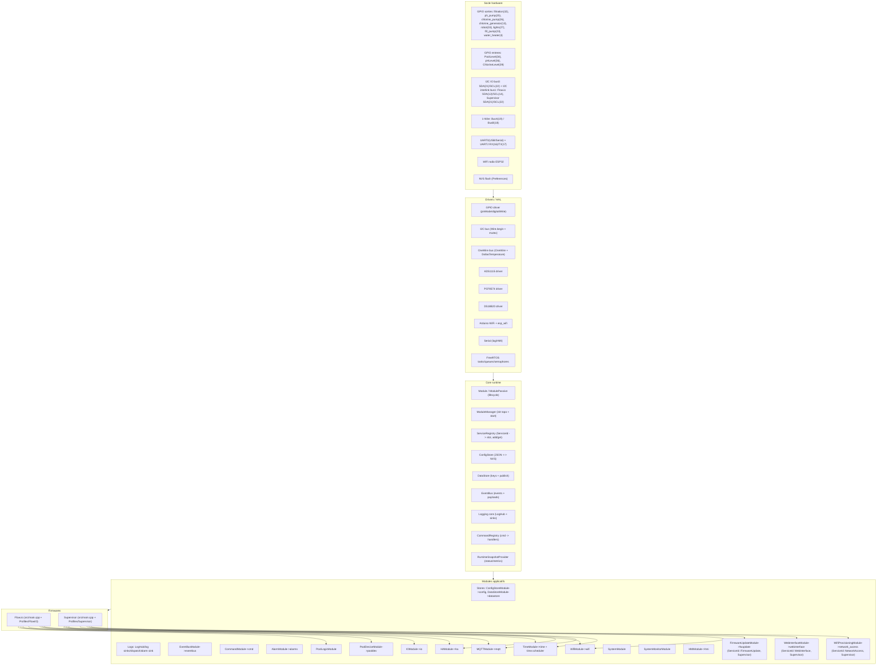

```mermaid
flowchart TB

%% Layer 0: Hardware
subgraph L0["Socle hardware"]
  HW1["GPIO sorties: filtration(32), ph_pump(25), chlorine_pump(26), chlorine_generator(13), robot(33), lights(27), fill_pump(23), water_heater(4)"]
  HW2["GPIO entrees: PoolLevel(34), pHLevel(36), ChlorineLevel(39)"]
  HW3["I2C IO bus0: SDA(21)/SCL(22) + I2C interlink bus1: Flow.io SDA(12)/SCL(14), Supervisor SDA(21)/SCL(22)"]
  HW4["1-Wire: BusA(19) / BusB(18)"]
  HW5["UART0(USB/Serial) + UART2 RX(16)/TX(17)"]
  HW6["WiFi radio ESP32"]
  HW7["NVS flash (Preferences)"]
end

%% Layer 1: Drivers / HAL
subgraph L1["Drivers / HAL"]
  D1["GPIO driver (pinMode/digitalWrite)"]
  D2["I2C bus (Wire.begin + mutex)"]
  D3["OneWire bus (OneWire + DallasTemperature)"]
  D4["ADS1115 driver"]
  D5["PCF8574 driver"]
  D6["DS18B20 driver"]
  D7["Arduino WiFi + esp_wifi"]
  D8["Serial (log/HMI)"]
  D9["FreeRTOS tasks/queues/semaphores"]
end

%% Layer 2: Core runtime
subgraph L2["Core runtime"]
  C1["Module / ModulePassive (lifecycle)"]
  C2["ModuleManager (init topo + start)"]
  C3["ServiceRegistry (ServiceId -> slot, add/get<T>)"]
  C4["ConfigStore (JSON <-> NVS)"]
  C5["DataStore (keys + publish)"]
  C6["EventBus (events + payloads)"]
  C7["Logging core (LogHub + sinks)"]
  C8["CommandRegistry (cmd -> handlers)"]
  C9["RuntimeSnapshotProvider (status/metrics)"]
end

%% Layer 3: Modules
subgraph L3["Modules applicatifs"]
  MStores["Stores: ConfigStoreModule->config, DataStoreModule->datastore"]
  MLogs["Logs: LogHub/log sinks/dispatch/alarm sink"]
  MEB["EventBusModule->eventbus"]
  MCmd["CommandModule->cmd"]
  MAlarm["AlarmModule->alarms"]
  MWiFi["WifiModule->wifi"]
  MTime["TimeModule->time + time.scheduler"]
  MMqtt["MQTTModule->mqtt"]
  MHA["HAModule->ha"]
  MIO["IOModule->io"]
  MPoolDev["PoolDeviceModule->pooldev"]
  MPoolLogic["PoolLogicModule"]
  MSys["SystemModule"]
  MSysMon["SystemMonitorModule"]
  MHMI["HMIModule->hmi"]
  MProv["WifiProvisioningModule->network_access (ServiceId::NetworkAccess, Supervisor)"]
  MWeb["WebInterfaceModule->webinterface (ServiceId::WebInterface, Supervisor)"]
  MFW["FirmwareUpdateModule->fwupdate (ServiceId::FirmwareUpdate, Supervisor)"]
end

%% Layer 4: Applications
subgraph L4["Firmwares"]
  AFlow["Flow.io (src/main.cpp + Profiles/FlowIO)"]
  ASup["Supervisor (src/main.cpp + Profiles/Supervisor)"]
end

%% Layer wiring
L0 --> L1 --> L2 --> L3 --> L4

%% Conceptual dependencies (examples)
AFlow --> MWiFi
AFlow --> MTime
AFlow --> MMqtt
AFlow --> MHA
AFlow --> MIO
AFlow --> MPoolDev
AFlow --> MPoolLogic

ASup --> MWiFi
ASup --> MProv
ASup --> MWeb
ASup --> MFW
ASup --> MMqtt
ASup --> MTime
ASup --> MHA
```

Les libellés `config`, `datastore`, `mqtt`, `network_access`, etc. correspondent aux noms texte de debug (`toString(ServiceId)`), tandis que le wiring réel entre modules passe par `ServiceId`.
